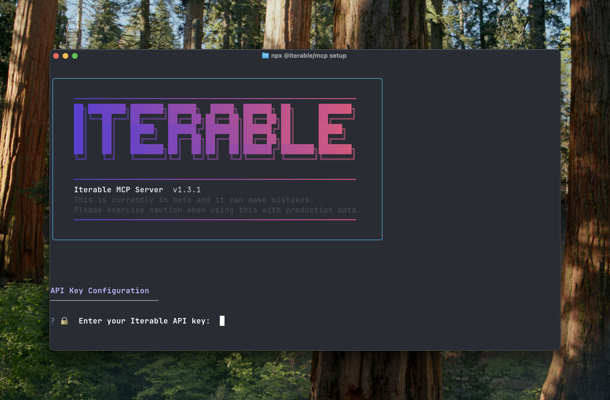
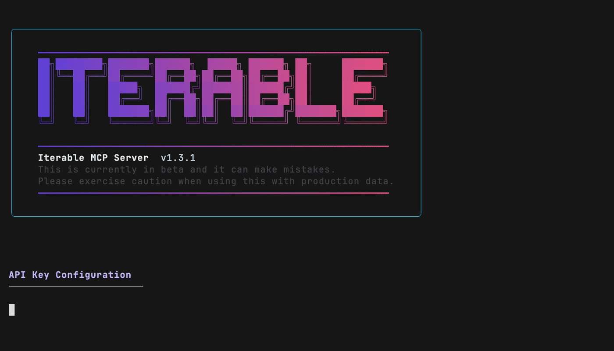

# Iterable MCP Server

[](https://www.npmjs.com/package/@iterable/mcp)



Talk to your Iterable data using natural language. Ask questions or give instructions like *"How many campaigns did we send last week?"*, *"Show me my most recent templates"*, or *"Build me a beautiful email template that does the following..."* and get instant answers without writing code or navigating dashboards.

**Supported AI clients:**
- [Cursor](https://cursor.com/)
- [Claude Desktop](https://www.claude.com/download)
- [Claude Code](https://github.com/anthropics/claude-code)
- [Gemini CLI](https://github.com/google-gemini/gemini-cli)
- [Windsurf](https://windsurf.com/)
- [Antigravity by Google](https://antigravity.google/)

## What is MCP?

[Model Context Protocol (MCP)](https://modelcontextprotocol.io/) is an open standard that lets AI assistants securely connect to external tools and APIs. This server acts as a bridge between your AI client and Iterable, translating natural language requests into safe API calls.

## Installation

**Prerequisites:**
- Node.js >= 20 (v22 LTS recommended)
- An Iterable API key

```bash
npx @iterable/mcp setup
```




To always use the latest version (auto-update on each restart), add `--auto-update`:

```bash
npx @iterable/mcp setup --auto-update
```

By default, the setup wizard configures the server in a safe, read‑only mode (no PII tools, no writes, no sends). To selectively enable elevated capabilities during setup, pass `--advanced`:

```bash
# Example: enable advanced setup to configure permissions
npx @iterable/mcp setup --advanced
```

What you'll choose (optional):
- **User PII** (`ITERABLE_USER_PII`): access user profile data, including email addresses, phone numbers, and custom data fields.
- **Writes** (`ITERABLE_ENABLE_WRITES`): create, update, and delete resources such as templates, lists, catalogs, campaigns, snippets, and user profiles.
- **Sends** (`ITERABLE_ENABLE_SENDS`): send messages (email, SMS, push, in-app, WhatsApp), trigger campaigns and journeys, schedule and abort campaigns, and track events. Requires writes to be enabled. *Note: creating a blast campaign will schedule it for delivery, matching the behavior of the underlying Iterable API; there is no way to create a draft campaign. If you only need to draft content, you can do so with sends disabled by working with templates instead.*

**IMPORTANT: Enabling writes and sends allows the AI agent to take real, potentially irreversible actions against your Iterable project, including sending messages to real users and deleting data. If you do not have the technical knowledge to properly review the agent's tool calls before they are executed, you should avoid enabling these flags, especially in production environments. It is entirely your choice to accept this risk. If you enable these capabilities, it is your responsibility to carefully review each action before allowing the agent to proceed.**

Note that permission settings are saved per key (see key management section below), allowing you to enable different permissions for different projects, e.g. only enable writes and sends for a sandbox project and disable them in production.

## What you can do

See the [available tools](TOOLS.md) for all tools with descriptions. All tools map directly to [Iterable API endpoints](https://api.iterable.com/api/docs).

Try these prompts:
- *"Get details on campaign 12345"*
- *"What email templates are available?"*
- *"Show me all my product catalogs"*
- *"What journeys are currently active?"*
- *"Show me events for user@example.com from the last 30 days"*
- *"Create a campaign called 'Holiday Sale' using template 456"*
- *"Export all user data from January 2024"*
- *"List users in my 'VIP Customers' list"*

## API Key Management

**Key Storage:**

API keys are stored in the `~/.iterable-mcp/keys.json` file and managed via the `npx @iterable/mcp keys` commands. On macOS the actual API key values are stored in the system Keychain. On Windows, API key values are encrypted using the Windows Data Protection API (DPAPI). On Linux, the API key values are stored directly in the file with restricted permissions (0o600).

Each key is tied to its API endpoint (US, EU, or custom) and to its permissions (view PII, write operations, send messages).

**How Key Selection Works:**
- You can store multiple API keys with different names (e.g., "production", "staging", "dev")
- Only ONE key is marked as **active** at a time
- The MCP server automatically uses whichever key is currently active
- Your first key is automatically set as active
- Switch between keys using the `activate` command

```bash
# List stored keys (shows which one is active with ● ACTIVE badge)
npx @iterable/mcp keys list

# Add a new key (interactive: prompts for name, region/endpoint, and API key)
# Your first key becomes active automatically
npx @iterable/mcp keys add

# Switch to a different key by name or ID (also switches endpoint)
npx @iterable/mcp keys activate production
npx @iterable/mcp keys activate staging

# Update an existing key (interactive: prompts for new values)
npx @iterable/mcp keys update <name-or-id>

# Delete a key by ID (requires ID for safety)
# Note: Cannot delete the currently active key - activate another first
npx @iterable/mcp keys delete <key-id>
```

## Advanced setup

### Prefer a global install?

If you'd rather not use `npx`, you can install globally. This lets you use `iterable-mcp` as a shorthand for `npx @iterable/mcp`.

```bash
pnpm add -g @iterable/mcp
iterable-mcp setup
```

**Note:** The setup command automatically configures the correct command path.

### Claude Code

The `setup --claude-code` command automatically configures Claude Code by running `claude mcp add` for you.

Alternatively, you can configure it manually:

```bash
# Add your API key first (see API Key Management section above)
npx @iterable/mcp keys add

# Then configure Claude Code
claude mcp add iterable -- npx -y @iterable/mcp

# Verify it was added
claude mcp list
```

If you have already configured Claude Desktop successfully, you can run this command to copy your MCP server settings to Claude Code:

```bash
claude mcp add-from-claude-desktop
```

**Note:** All of the above `claude mcp` commands will save the settings to `~/.claude.json`, which makes the configured MCP servers available across all projects. For shared, project-specific MCP configs, create a `.mcp.json` file in the root of your project.

For more information, see the [Claude Code MCP documentation](https://docs.claude.com/en/docs/claude-code/mcp).

### Manual configuration (Cursor, Claude Desktop, Windsurf, Gemini CLI & Antigravity)

The above commands will automatically configure your AI tool to use the MCP server by editing the appropriate configuration file, but you can also manually edit the appropriate configuration file:
- **Claude Desktop:** `~/Library/Application Support/Claude/claude_desktop_config.json`
- **Cursor:** `~/.cursor/mcp.json`
- **Windsurf:** `~/.codeium/windsurf/mcp_config.json`
- **Antigravity:** `~/.gemini/antigravity/mcp_config.json`
- **Gemini CLI:** `~/.gemini/settings.json`

All five use the same configuration format:

**Recommended: Using key manager:**
```bash
# First, add your API key (interactive prompts)
npx @iterable/mcp keys add
```

Then edit your config file:
```json
{
  "mcpServers": {
    "iterable": {
      "command": "npx",
      "args": ["-y", "@iterable/mcp"]
    }
  }
}
```

No `env` section needed - API key and base URL are loaded automatically.

**Alternative: Environment variables:**
```json
{
  "mcpServers": {
    "iterable": {
      "command": "npx",
      "args": ["-y", "@iterable/mcp"],
      "env": {
        "ITERABLE_API_KEY": "your-iterable-api-key-here",
        "ITERABLE_BASE_URL": "https://api.iterable.com"
      }
    }
  }
}
```

### Using custom Node/NPX paths

If you need to use a custom path to node or npx (for example, if they are not in your PATH), you can set environment variables before running the setup command:

```bash
# Set custom paths
export ITERABLE_MCP_NODE_PATH="/path/to/custom/node"
export ITERABLE_MCP_NPX_PATH="/path/to/custom/npx"

# Then run setup
npx @iterable/mcp setup --cursor
```

Alternatively, you can manually edit your configuration file (after adding your key):

```json
{
  "mcpServers": {
    "iterable": {
      "command": "/custom/path/to/npx",
      "args": ["-y", "@iterable/mcp"]
    }
  }
}
```

No `env` section is needed if using the key manager.

### Environment variables

Variables marked as **managed** are automatically configured by the key manager. They take precedence over environment variables when both are present. Setting environment variables directly is useful for CI/CD pipelines, Docker containers, or other non-interactive environments where the key manager isn't available.

| Variable | Managed | Description |
|----------|-------------|-------------|
| `ITERABLE_API_KEY` | ✅ | Your Iterable API key. Required if not using key manager |
| `ITERABLE_BASE_URL` | ✅ | Base URL for the Iterable API (default: `https://api.iterable.com`) |
| `ITERABLE_USER_PII` | ✅ | Set to `true` to enable tools that access user PII data (default: `false`) |
| `ITERABLE_ENABLE_WRITES` | ✅ | Set to `true` to enable tools that perform write operations (default: `false`) |
| `ITERABLE_ENABLE_SENDS` | ✅ | Set to `true` to enable tools that can send messages (default: `false`). Requires writes to be enabled |
| `ITERABLE_DEBUG` | | Set to `true` for API request logging |
| `LOG_LEVEL` | | Set to `debug` for troubleshooting |

### Custom endpoints

- The CLI supports selecting the US or EU region, or entering a custom endpoint.
- For security, HTTPS is required for custom endpoints. The only exception is localhost development:
  - Allowed: `http://localhost:3000`, `http://127.0.0.1:8080`, `http://[::1]:4000`
  - Not allowed: plain `http://` on non-local hosts (use `https://` instead)
- When a non-`*.iterable.com` domain is provided, the CLI will ask for confirmation.

## Troubleshooting

- Claude CLI missing: install `claude` CLI, then re-run `npx @iterable/mcp setup --claude-code`.
- macOS Keychain issues: Ensure Keychain is accessible and re-run setup if needed.

### Client-specific limitations

#### Windsurf (Codeium)

**Tool limit:** Windsurf has a [maximum limit of 100 tools](https://docs.windsurf.com/windsurf/cascade/mcp) that Cascade can access at any given time. When all permissions are enabled (`ITERABLE_USER_PII=true`, `ITERABLE_ENABLE_WRITES=true`, `ITERABLE_ENABLE_SENDS=true`), the Iterable MCP server exposes **105 tools**, which exceeds this limit.

**Workaround:** Use restricted permissions to stay under the 100-tool limit:
- With default permissions (all disabled): 26 tools ✅
- With PII only: 37 tools ✅
- With PII + writes: 87 tools ✅
- With all permissions: 105 tools ❌ (exceeds Windsurf limit)

You can configure permissions when adding a key:
```bash
npx @iterable/mcp keys add --advanced
```

Or update an existing key's permissions:
```bash
npx @iterable/mcp keys update <key-name> --advanced
```

**Process persistence:** After switching API keys with `keys activate`, you must **fully restart Windsurf** (quit and reopen the application). Windsurf keeps MCP server processes running in the background, and they don't automatically reload when you switch keys.

#### Antigravity

**Tool limit:** Antigravity has a maximum limit of 100 tools per MCP server. When all permissions are enabled (`ITERABLE_USER_PII=true`, `ITERABLE_ENABLE_WRITES=true`, `ITERABLE_ENABLE_SENDS=true`), the Iterable MCP server exposes **105 tools**, which exceeds this limit.

**Workaround:** Use restricted permissions to stay under the 100-tool limit:
- With default permissions (all disabled): 26 tools ✅
- With PII only: 37 tools ✅
- With PII + writes: 87 tools ✅
- With all permissions: 105 tools ❌ (exceeds Antigravity limit)

You can configure permissions when adding a key:
```bash
npx @iterable/mcp keys add --advanced
```

Or update an existing key's permissions:
```bash
npx @iterable/mcp keys update <key-name> --advanced
```

## Contributing

See the [contributing guidelines](CONTRIBUTING.md) for development setup, building from source, and running tests.

## Security

See the [security policy](SECURITY.md) for reporting vulnerabilities.

## Beta Feature Reminder

Iterable's MCP server is currently in beta. MCP functionality may change, be
suspended, or be discontinued at any time without notice. This software is
provided "as is" and is open source and ready for you to experiment with. For
more information, refer to [Iterable Beta Terms](https://iterable.com/trust/beta-terms/).

## License

This project is licensed under the MIT License. See the [license](LICENSE.md) for details.
